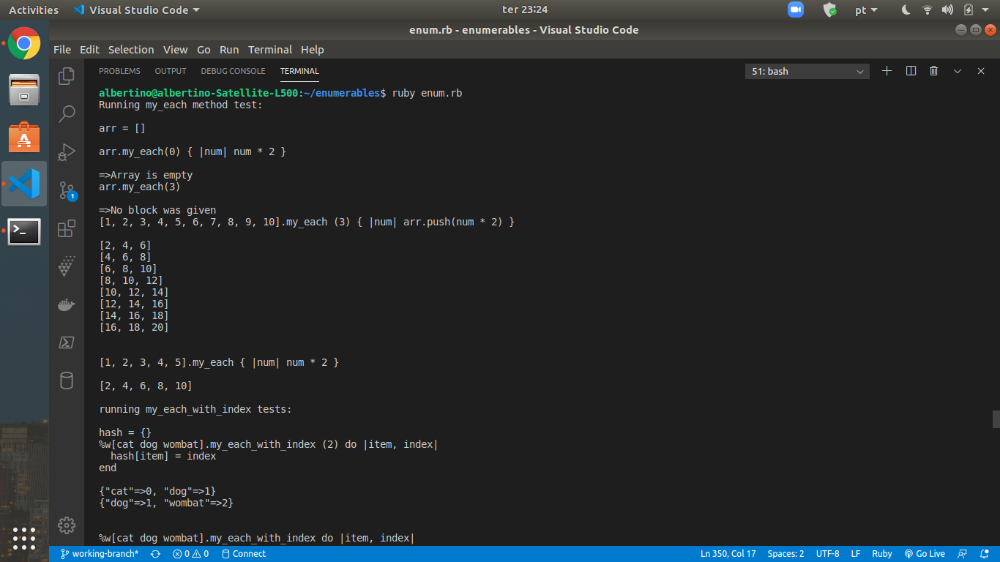

# Advanced Building Blocks: Enumerable

> This is a collection of the Ruby Enumerable-like methods implemented using Ruby. It corresponds to  my first solo project in the Ruby Course from the Microverse Main Curiiculum

The project contains descriptions and comments for all methods implemented, as well as for the respective deployment tests.

## Built With

- Ruby
- VS Code
- RSpec
- Git
- GitHub

## Live Demo

[Live Demo Link](https://github.com/Albertino2020/enumerable)

## Author

👤 Albertino Francisco

- Github: [@Albertino2020](https://github.com/Albertino2020)
- Twitter: [@albertino2050](https://twitter.com/albertino2050)
- Linkedin: [Albertino Francisco, PhD](https://linkedin.com/boamorte)

## Contributor

👤 Mupa M'mbetsa Nzaphila

- Github: [@Mupa1](https://github.com/Mupa1)
- Twitter: [@mupa_mmbetsa](https://twitter.com/mupa_mmbetsa)
- Linkedin: [Mupa M'mbetsa Nzaphila](https://linkedin.com/mupa-mmbetsa)

## 🤝 Contributing

Contributions, issues and feature requests are welcome!

Feel free to check the [issues page](issues/).

## Show your support

Give a ⭐️ if you like this project!

## 📝 License

This project is [MIT](lic.url) licensed.
